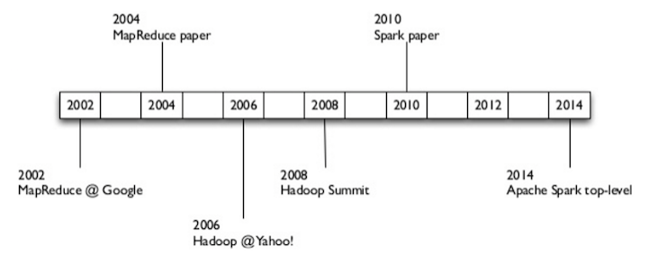
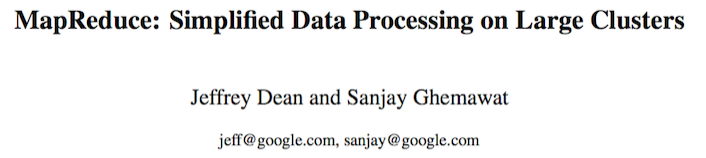
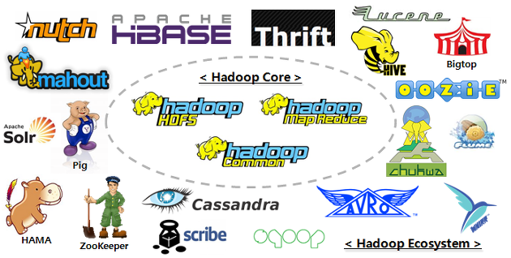
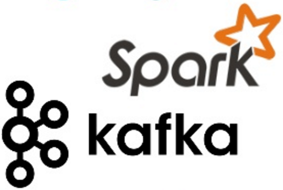
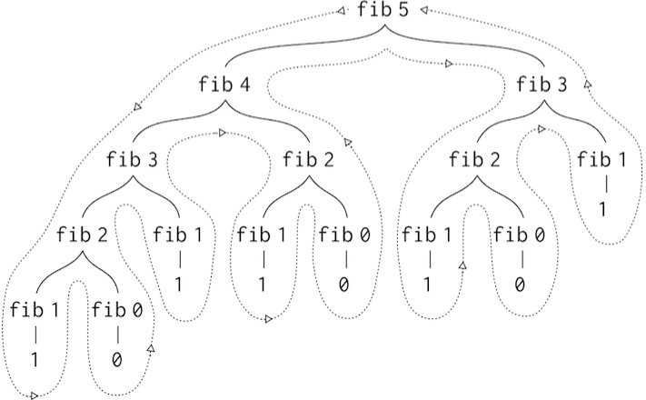
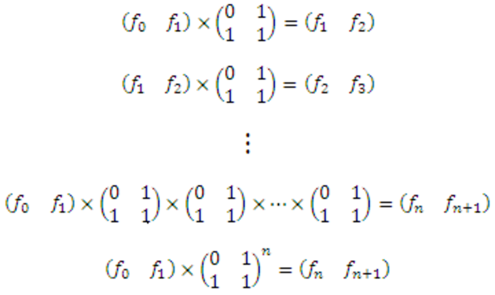
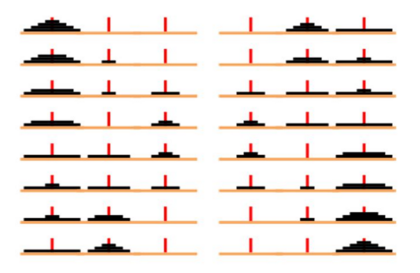
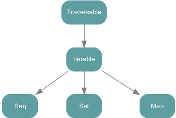
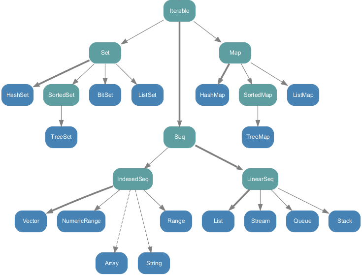

  <big><b>Introduction to Scala </b></big>  
   

  <code>chris@datascience.com</code>
  <code>jason@datascience.com</code>
   
   

---

#Resources

* Chiusano and Bjarnason's [Functional Programming in Scala](https://www.manning.com/books/functional-programming-in-scala)
* Twitter's [Scala School](https://twitter.github.io/scala_school/)
* This course's [Github Project](https://github.com/cem3394/scala-for-data-scientists/tree/gh-pages)

---

#Lecture 1: Recursion

---

#John Backus

"Conventional programming languages are growing
ever more enormous, but not stronger. Inherent defects
at the most basic level cause them to be both fat and
weak: their primitive word-at-a-time style of programming
inherited from their common ancestor--the von
Neumann computer, their close coupling of semantics to
state transitions, their inability to effectively use powerful
combining forms for building new programs from existing ones,
and their lack of useful mathematical properties for reasoning
about programs..."

-  [Can Programming Be Liberated from the von Neumann Style?](http://dl.acm.org/citation.cfm?id=359579), 1978 ACM Turing Award Lecture

---

#The von Neumann Bottleneck

We need other techniques for defining high-level abstractions such
as collections, polynomials, geometric shapes, strings, documents.
Ideally: Develop theories of collections, shapes, strings, …

 * *Reduce* syntactical noise
 * Provide useful types that solve *many classes* of problems
 * *Add* type-safety with minimal "extra work"

.notes: Decouple semantics from state transitions using powerful primitives.

---

#A Bit of History

[https://medium.com/@markobonaci/the-history-of-hadoop-68984a11704](https://medium.com/@markobonaci/the-history-of-hadoop-68984a11704)

---

#OpenMP (1997)

.notes: started w/ Backus' Fortran 1.0 in 1997. parallel processing only done on expensive supercomputers. complex and not robust to node failures.

---

#MapReduce (2004)

.notes: combined FP primitives with world-class cluster computing know-how. the simple MR framework (read Backus) meant that all of a sudden it became relatively simple and reliable to compute with large arrays of cheap nodes, any of which might fail. these guys are legends. they are also behind tensorFlow.

---

#Hadoop (2006)

.notes: open source MapReduce. became a top level apache project in 2006. batched processing. static pageRank anecdote. by 2006 google had already moved on to streaming.

---

#Kafka and Spark (2012)

.notes: Both Scala projects. Came out of LinkedIn and Berekley's AmpLabs respectively. Framework and language have converged. Scala Collections API, Spark API, Scalding API, Kafka API are almost identical.

---

#Start Your REPLs!

    scala> 11 % 2
    res0: Int = 1
    scala> res0
    res1: Int = 1
    scala> 5 + 2.0
    res2: Double = 7.0

.notes: res0 is an automatically created value name given by the interpreter to the result of your expression. It has the type Int and contains the Integer 2. You can use :paste for longer code. Note the type casting.

---

#Basic Types & Type Hierarchy

    !scala
    Byte    // 8-bit int in [-27, 27 - 1]
    Short   //16-bit int in [-2^15, 2^15-1]
    Int     //32-bit int in [-2^31, 2^31-1]
    Long    //64-bit int in [-2^63, 2^63-1]
    Float   //32-bit IEEE 754 single-precision
    Double  //64-bit IEEE 754 double-precision
    Char    //16-bit int in [U+0000, U+FFFF]
    String  //a (finite) sequence of Chars
    Boolean //true or false
    Unit    //corresponds to no value
    Null    //null or empty reference
    Nothing //the subtype of every other type
    Any     //the supertype of any type
    AnyRef  //the supertype of any reference type    

---

[http://www.scala-lang.org/documentation/api.html](http://www.scala-lang.org/documentation/api.html)

---

#Vals and Vars

    scala> val two = 1 + 1
    two: Int = 2
    scala> var name = "数据"
    name: String = 数据
    scala> name += "科学"
    scala> name
    res3: String = 数据科学

.notes: In general, an identifier starts with a letter and can be followed by letters, digits, the symbol _ or any Unicode character in the range 0020–007F except square brackets, parentheses, and periods. You cannot change the binding to a val. If you need to change the binding, you can use a var instead.

---

#Type Declaration and Inference

    scala> var three: Int = 1 + 2
    three: Int = 3
    scala> three = "Data Science"
    error: type mismatch

.notes: Variable reassignment is still subject to typing constraints. Scala is a strongly typed language. This is one of the big differences coming from Python. Scala's type system is very rich and is honestly a pleasure to work with once you get used to it. The Scala compiler does a lot of type inference, so type annotations—while good practice—are often not required.

---

#Semicolons

    !scala
    val s = "hello"; println(s)

.notes: In a Scala program, a semicolon at the end of a statement is usually optional. You can type one if you want but you don’t have to if the statement appears by itself on a single line. On the other hand, a semicolon is required if you write multiple statements on a single line. If you want to enter a statement that spans multiple lines, most of the time you can simply enter it and Scala will separate the statements in the correct place.

---

#Functions

    scala> def plusOne(x: Int): Int = x + 1
    plusOne: (x: Int)Int
    scala> def plusTwo(x: Int) = x + 2
    plusTwo: (x: Int)Int

.notes: You also need to specify the type signature for function parameters, though the compiler can often infer the return type (important exception to this is recursive functions).

___

#Never use `return` ([why?](https://tpolecat.github.io/2014/05/09/return.html))

    !scala
    def max(x: Int, y: Int) = {
      if (x>y) x
      else y
    }

.notes:  the return value is by default the last line. Scala has a `return` keyword, but you should never use it.

___

#Functions vs Procedures

    scala> def foo(): Unit = "this gets lost"
    foo: ()Unit
    scala> def bar() { "this gets lost too" }
    bar: ()Unit
    scala> def foobar() = { "this gets returned" }
    foobar: ()String

.notes: Another puzzler to watch out for is that whenever you leave off the equals sign before the body of a function, its result type will definitely be Unit. This is true no matter what the body contains, because the Scala compiler can convert any type to Unit. In this example, the String is converted to Unit because Unit is the declared result type of function foo. The Scala compiler treats a function like `bar` defined in the procedure style, i.e., with curly braces but no equals sign, essentially the same as a function that explicitly declares its result type to be Unit. The puzzler occurs, therefore, if you intend to return a non-Unit value, but forget the equals sign.

---

#Lexical Scoping

    !scala
    val x = 0
    def f(y: Int) = y + 1
    val result = {
      val x = f(3)
      x * x
    } + x

.notes: QUESTION: what is the value of x? y is a bound variable, x is free.

---

#Recursion

    !scala
    def factorial(n: Int): Int = {
      if (n == 0) 1
      else n * factorial(n-1)
    }

.notes: with recursive functions we have to define the return type otherwise the type inference algorithm would get stuck in an infinite loop.  

---

#Function Literals

    scala> (1 to 3).map((arg: Int) => factorial(arg))
    res0: immutable.IndexedSeq[Int] = Vector(1, 2, 6)

(arg: Int) => factorial(arg)
(1 to 3)

.notes:  INTRODUCE SEPARATELY All functions are separated into common parts, which are the same in every invocation of the function, and non-common parts, which may vary from one function invocation to the next. The common parts are in the body of the function, while the non-common parts must be supplied via arguments. When you use a function value as an argument, the non-common part of the algorithm is itself some other algorithm! At each invocation of such a function, you can pass in a different function value as an argument, and the invoked function will, at times of its choosing, invoke the passed function value. These higher-order functions—functions that take functions as parameters—give you extra opportunities to condense and simplify code. A great example of this is the Scala Collections API.

---

    scala> (1 to 3).map(arg => factorial(arg))
    res1: immutable.IndexedSeq[Int] = Vector(1, 2, 6)
    scala> (1 to 3).map(factorial _ )
    res2: immutable.IndexedSeq[Int] = Vector(1, 2, 6)
    scala> (1 to 3).map(factorial)
    res3: immutable.IndexedSeq[Int] = Vector(1, 2, 6)
    scala> (1 to 3) map factorial
    res4: immutable.IndexedSeq[Int] = Vector(1, 2, 6)

.notes: Just like lambdas in Python. Scala's type system infers the Int arg and return types. If the literal consists of a single statement (the return) and a single argument then you can leave them out. These are called partially applied functions and we will return to them next class. Scala's type system infers the Int arg and return types. Method dots are optional. Finally a bit about the return type. Scala's type system is very rich. We'll talk a lot more about Scala's collection library in the next weeks. It's data structures are much more powerful that Python's. IndexedSeq is a Trait (like an interface in Java).

---

#Procedures vs Processes

    factorial(6)
    6 * factorial(5)
    6 * 5 * factorial(4)
    6 * 5 * 4 * factorial(3)
    6 * 5 * 4 * 3 * factorial(2)
    6 * 5 * 4 * 3 * 2 * factorial(1)
    6 * 5 * 4 * 3 * 2 * 1 * factorial(0)
    6 * 5 * 4 * 3 * 2 * 1 * 1
    720

.notes: Let's look at the computational process that results from calling factorial. Odersky discusses the same thing in the context of rewriting rules. But what happens if we run this on large numbers?

---

#Tail Recursion

    !scala
    def factorial2(n: Int): Int = {
      def factIter(n: Int, total: Int): Int = {
        if (n == 0) total
        else factIter(n-1, n*total)
      }
      factIter(n,1)
    }
    (0 to 5).map(factorial2)

.notes: Functions which call themselves as their last action, are called tail recursive. The Scala compiler detects tail recursion and replaces it with a jump back to the beginning of the function, after updating the function parameters with the new values. The moral is that you should not shy away from using recursive algorithms to solve your problem. Often, a recursive solution is more elegant and concise than a loop-based one. If the solution is tail recursive, there won’t be any runtime overhead to be paid.

---

#Iterative Processes

    factorial2(6)
    factIter(6,1)
    factIter(5,6)
    factIter(4,30)
    factIter(3,120)
    factIter(2,360)
    factIter(1,720)
    factIter(0,720)
    720

---

    !scala
    def fibonacci(n: Int): Int = {
      if (n == 0 || n == 1) 1
      else fibonacci(n - 1) + fibonacci(n - 2)
    }

.notes: QUESTION: what is the aysmptotic computational complexity of fibonacci(n)?

---

.notes: Notice that the entire computation of (fib 3) -- almost half the work -- is duplicated. Process is O(theta^n)

---

    !scala
    def fibonacci2(n: Int): Int = {
      def fibIter(n: Int, a: Int, b: Int): Int = {
        if (n==0) a
        else fibIter(n-1, b, a+b)
      }
      fibIter(n,1,1)
    }
    (0 to 50) map fibonacci2

---

---

#Application: Tower of Hanoi

Write a `hanoi` function that generates a string of instructions solving the Tower of Hanoi problem.

---

The objective is to move the entire stack to another rod, obeying the following three rules:

* Only one disk can be moved at a time.
* Each move consists of taking the upper disk from one of the stacks and placing it on top of another stack.
* No disk may be placed on top of a smaller disk.

---

* Can you make `hanoi` referntially transparent?
* How about tail recursive?

---

#Challenge Question

Write a function `pascal(c: Int, r: Int)` that generates the (i,j) value of Pascal's Triangle. Can you make it tail recursive? Optional: Write a second function `showTriangle` that formats the triangle as follows:

    scala> print(showTriangle(7))
    1
    1 1
    1 2 1
    1 3 3 1
    1 4 6 4 1
    1 5 10 10 5 1
    1 6 15 20 15 6 1
    1 7 21 35 35 21 7 1

---

#Lecture 2: Currying

---

#John Backus

"...An alternative functional style of programming is
founded on the use of combining forms for creating
programs. Functional programs deal with structured
data, are often non-repetitive and non-recursive, are hierarchically
constructed, and do not require the complex machinery of procedure
declarations to become generally applicable. Combining
forms can use high level programs to build still higher
level ones in a style not possible in conventional languages."

-  [Can Programming Be Liberated from the von Neumann Style?](http://dl.acm.org/citation.cfm?id=359579), 1978 ACM Turing Award Lecture

---

#Avoiding the von Neumann Bottleneck

Avoid conceptualizing data structures word-by-word.

* imperative state  
* loop-based logic
* side effects

---

#Use var sparingly

    !scala
    def printArgs1(args: Array[String]): Unit = {
      var i = 0
      while (i < args.length) {
        println(args(i))
        i += 1
      }
    }

    def printArgs2(args: Array[String]): Unit = {
      args.map(println)
    }

.notes: Simpler to pass println to map

---

#Use side effects sparingly

    !scala
    def printArgs2(args: Array[String]): Unit = {
      args.map(println)
    }

    def formatArgs(args: Array[String]): String =
    {
      args.mkString("\n")
    }
    println(formatArgs(Array("nine", "ten")))

.notes: We've isolated the non-referentially transparent code to one line. You can tell b/c the return type is not Unit. We can now refactor the code without fear of breaking things. QUESTION: Why might this last part be inefficient? O(n^2) analysis. Sort of a busted example. Upper vs Lower case?

---

#Application: QuickSort

    !scala
    def swap(i: Int, j: Int): Unit =  {
      val t = xs(i); xs(i) = xs(j); xs(j) = t
    }

.notes: QUESTION: What will happen if I run this in the interpreter? xs is in the closure of swap, but the compiler won't be able to find it.

---

    !scala
    def quickSort(xs: Array[Int]): Unit = {
      def sortHelper(l: Int, r: Int): Unit =  {
        val pivot = xs((l + r) / 2)
        var i = l; var j = r
        while (i <= j) {
          while (xs(i) < pivot) i += 1
          while (xs(j) > pivot) j -= 1
          if (i <= j) swap(i, j); i += 1; j -= 1  
        }
        if (l < j) sort1(l, j)
        if (j < r) sort1(i, r)
      }
      sortHelper(0, xs.length - 1)
    }

---

    !scala
    def quickSort2(xs: List[Int]): List[Int] = {
      if (xs.length <= 1) xs
      else {
        val pivot = xs(xs.length / 2)
        List.concat(
          quickSort2(xs filter (pivot >)),
          xs filter (pivot ==),
          quickSort2(xs filter (pivot <)))
      }
    }

.notes: The functional program captures the essence of the quickSort algorithm in a concise way. But where the imperative implementation operates in place by modifying the argument array, the second implementation take a functional data structure called a list and returns a new sorted list, leaving the original list unchanged. The functional implementation makes it look like Scala is a language that’s specialized for functional operations array-like data structures. In fact, it is not; all of the operations used in the example are simple library methods of a sequence class Seq[T] which is part of the standard Scala library, and which itself is implemented in Scala. Because arrays are instances of Seq all sequence methods are available for them.The functional implementation thus requires more transient memory than the imperative one. QUESTION: what is going on with xs filter (pivot >) ?

---

#Higher-Order Functions

The `filter` method of an object of type `List[T]` thus has the signature:

    !scala
    def filter(p: T => Boolean): List[T]

.notes: In particular, there is the method filter which takes as argument a predicate function. This predicate function must map array elements to boolean values. The result of filter is a list consisting of all the elements of the original array for which the given predicate function is true. Here, T => Boolean is the type of functions that take an element of type t and return a Boolean. Functions like filter that take another function as argument or return one as result are called higher-order functions. This functionality is closely related to polymorphism and dynamic method dispatch in other OO languages like Java or C++.

---

    scala> val numbers = List(1, 2, 3, 4, 5, 6)
    numbers: List[Int] = List(1, 2, 3, 4, 5, 6)
    scala> numbers.filter _
    res0: (Int => Boolean) => List[Int] = <function1>

.notes: QUESTION: Why is the _ required here? The reason is due to a design compromise in the language. Here Scala diverges somewhat from other functional languages like Haskell or Lisp.

---

#Scala's `_`

    scala> val foo = (x: Int) => x % 2 == 0
    foo: Int => Boolean = <function1>
    scala> numbers.filter(_ % 2 == 0)
    res1: List[Int] = List(2, 4, 6)    

.notes: very idiomatic in Scala to use _ for throwaway parameters. Easier on the working memory.

---

    !scala
    val foo = _ + _

.notes: QUESTION: is this an error? The anonymous function (x,y) => x + y can be written as _ + _ in situations where the types of x and y could be inferred by Scala. This is a useful shorthand in cases where the function parameters are mentioned just once in the body of the function. Each underscore in an anonymous function expression like _ + _ introduces a new (unnamed) function parameter and references it. Arguments are introduced in left-toright order. In this case the compiler needs more type information to infer missing parameters.

---

    scala> val foo = _ + _
    error: missing parameter types
    val foo = (_: Int) + (_: Int)
    foo: (Int, Int) => Int = <function2>

.notes: QUESTION: what is <function2>?

---

#What are `function1` and `function2`?

More on this next lecture.
[http://www.scala-lang.org/api/rc2/scala/Function2.html](http://www.scala-lang.org/api/rc2/scala/Function2.html)

---

#Partially Applied Functions

    !scala
    def sum(a: Int, b: Int, c: Int) = a + b + c
    val foobar = sum(1, 2, _: Int)

.notes: I told you last time we'd get to these. QUESTION: what is the type of foobar?

---

    scala> val foobar = sum(1, 2, _: Int)
    foobar: Int => Int = <function1>
    scala> foobar(3)
    res0: Int = 6

.notes: you can also partially apply a function to none of its arguments

---

    scala> println(sum)
    error: value sum is not a member of Unit
    scala> println(sum _ )
    <function1>

.notes: This is an example of the design trade-offs of Scala and classical functional languages such as Haskell or ML. In these languages, partially applied functions are considered the normal case. Furthermore, these languages have a fairly strict static type system that will usually highlight every error with partial applications that you can make. Scala bears a much closer relation to imperative languages such as Java, where a method that’s not applied to all its arguments is considered an error. Scala normally requires you to specify function arguments that are left out explicitly, even if the indication is as simple as a ‘_’. Scala allows you to leave off even the _ only when a function type is expected.

---

#Challenge Question

    !scala
    def dropWhile[T](l: List[T], f: T => Boolean): List[T]

---

    scala> dropWhile(numbers, (x: Int) => x < 4)
    res2: List[Int] = List(4, 5, 6)  

---

---

    !scala
    def dropWhile[T](l: List[T], f: T => Boolean): List[T] =
      l match {
        case x :: xs if f(x) => dropWhile(xs, f)
        case _ => l
      }

---

    scala> dropWhile(numbers, x => x < 4)
    error: missing parameter type
    scala> dropWhile(numbers, (x: Int) => x < 4)
    res3: List[Int] = List(4, 5, 6, 7, 8)

.notes:  It’s unfortunate that we need to state that the type of x is Int. The first argument to dropWhile is a List[Int], so the function in the second argument must accept an Int. Scala can infer this fact if we group dropWhile into two argument lists.

---

#Currying

    !scala
    def dropWhile2[T](l: List[T])(f: T => Boolean): List[T] =
      l match {
        case x :: xs if f(x) => dropWhile2(xs)(f)
        case _ => l
      }

.notes: dropWhile2 is returning a function, which we then call with the argument f (in other words, dropWhile is curried). One reason for grouping the arguments this way is to assist with type inference. We can now use dropWhile without annotations:

---

    scala> dropWhile2(numbers) (x => x < 4)
    res4: List[Int] = List(4, 5, 6, 7, 8)

.notes:  More generally, when a function definition contains multiple argument groups, type information flows from left to right across these argument groups. Here, the first argument group fixes the type parameter A of dropWhile to Int, so the annotation on x => x < 4 is not required. This is an  unfortunate restriction of the Scala compiler; other functional languages like Haskell and OCaml provide complete inference, meaning type annotations are almost never required.

---

#Application: Summing Functions

    !scala
    def sum(f: Int => Int, a: Int, b: Int): Int = {
      if (a > b) 0
      else f(a) + sum(f, a + 1, b)
    }

---

    !scala
    def sum(f: Int => Int, a: Int, b: Int): Int = {
      if (a > b) 0
      else f(a) + sum(f, a + 1, b)
    }
    sum(_ * 2, _: Int, _: Int)

.notes: QUESTION: What is the return type here?

---

    scala> sum(_ * 2, _: Int, _: Int)
    res5: (Int, Int) => Int = <function2>

---

    !scala
    def sumDoubles(a: Int, b: Int): Int =
      sum(_ * 2, a, b)
    def sumQuintuples(a: Int, b: Int): Int =
      sum(_ * 5, a, b)

.notes: but this isn't DRY, I'm carrying a and b around everywhere

---

    !scala
    def sum2(f: Int => Double): (Int, Int) => Double = {
      def sumF(a: Int, b: Int): Double =
        if (a > b) 0 else f(a) + sumF(a + 1, b)
      sumF
    }  
    sum2(x => x * x)(0, 10)

.notes: the function sum is applied to the squaring function (x => x * x). The resulting function is then applied to the second argument list: (0, 10).

---

    !scala
    def sum3(f: Int => Double)(a: Int, b: Int): Double =
      if (a > b) 0 else f(a) + s3(f)(a + 1, b)

---

    def foo(x: Int): Double = 1/factorial(x).toDouble
    sum3(foo)(0,10)

.notes: QUESTION: What is the return value here?

---

    scala> sum3(foo)(0,10)
    res6: Double = 2.7182818

---

#Application: Pascal's Triangle

    !scala
    def pascal(r: Int)(c: Int): Int = {
      if (r == 0 || c == 0 || r == c) 1
      else pascal(r-1)(c-1) + pascal(r-1)(c)
    }

---

    !scala
    def pascal(r: Int)(c: Int): Int = {
      if (r == 0 || c == 0 || r == c) 1
      else pascal(r-1)(c-1) + pascal(r-1)(c)
    }
    pascal(4)(_)

.notes: QUESTION: What is the return type here?

---

    scala> pascal(4) _
    res7: Int => Int = <function1>

---

    !scala
    def showTriangle(rows: Int) = {
      val lines = for {
        r <- 0 until rows
      } yield (0 to r) map pascal(r) mkString " "
      "\n" + (lines mkString "\n")
    }
    println(showTriangle(10))

.notes: Any time you find a control pattern repeated in multiple parts of your code, you should think about implementing it as a new control structure. Earlier in the chapter you saw filesMatching, a very specialized control pattern. Consider now a more widely used coding pattern: open a resource, operate on it, and then close the resource.

---

#Application: Code Refactoring

    !scala
    def sum(l: List[Int]): Int = l match {
      case Nil => 0
      case x :: xs => x + sum(xs)
    }
    def prod(ds: List[Double]): Double = ds match {
      case Nil => 1.0
      case x :: xs => x * prod(xs)
    }

.notes: Note how similar these two definitions are. Whenever you encounter duplication like this, you can generalize it away by pulling subexpressions out into function arguments. If a subexpression refers to any local variables (the + operation refers to the local variables x and xs introduced by the pattern, similarly for product), turn the subexpression into a function that accepts these variables as arguments.

---

#`foldRight`

    !scala
    def foldRight[A, B](l: List[A], z: B)(f:(A, B) => B): B =
      l match {
        case Nil => z
        case x :: xs => f(x, foldRight(xs, z)(f))
      }

.notes: foldR is generalized on two types, A & B. It is also curried.

---

    !scala
    def sum2(l: List[Int]) = foldRight(l, 0)(_ + _)
    def prod2(l: List[Double]) = foldRight(l, 1.0)(_ * _)

---

One way of describing what foldRight does is that it replaces the constructors of a list, `Nil` and `Cons`, with `z` and `f`:

    !scala
    Cons(1, Cons(2, Nil))
    f (1, f (2, z ))

---

    !scala
    foldRight(Cons(1, Cons(2, Cons(3, Nil))), 0)(_ + _)
    1 + foldRight(Cons(2, Cons(3, Nil)), 0)(_ + _)
    1 + (2 + foldRight(Cons(3, Nil), 0)(_ + _))
    1 + (2 + (3 + (foldRight[Integer,Integer](Nil, 0)(_ + _))))
    1 + (2 + (3 + (0)))
    6

---

#Challenge Question

What are the return types of the following partial function applications?

    !scala
    foldRight(numbers, _: Int)(_ + _)
    foldRight(numbers, _: Int) _
    foldRight(_: List[Int], 0) _
    foldRight(_: List[Int], _: Int) _

---

    !scala

    foldRight(numbers, _: Int)(_ + _)
    //Int => Int
    foldRight(numbers, _: Int) _
    //Int => (((Int, Int) => Int) => Int)
    foldRight(_: List[Int], 0) _
    //List[Int] => (((Int, Int) => Int) => Int)
    foldRight(_: List[Int], _: Int) _
    //(List[Int], Int) => ((Int, Int) => Int) => Int

.notes: the last is the type signature of foldR itself when A = Int and B = Int.

---

#Challenge Question

Use `foldRight` to implement a function `kthLast[T](l: List[T], k: Int): T` that returns the k-th *last* element of a linked list.

    scala> kthLast(List(1,2,3,4,5), 2)
    res8: Int = 4

---

#Hint

Use a helper function `getK[T](elt: T, cache: List[T]): List[T]` and pass it into `foldRight`.

---

#Lecture 3: Traits and Classes

---

#Objects

The word 'object' has a dual meaning in Scala. As with Java, you use it to refer to an instance of a class, but in Scala, `object` is also a keyword.

Object, class and trait names are usually capitalized in Scala.

---

#Singleton Objects

    !scala
    object Hello {
      def main(args: Array[String]) {
      println("Hello, world")
      }
    }

---

    $ scalac Hello.scala
    $ scala Hello
    Hello, world

---

Another approach is to define an object that extends the `App` trait. Using this approach, the following code creates a simple but complete Scala application.

When using this approach, any command-line arguments to your application are implicitly available through an `args` object, which is inherited from the `App` trait. More on traits in a minute.

    !scala
    object Hello2 extends App {
      if (args.length == 1)
        println(s"Hello, ${args(0)}")
      else
        println("I didn't get your name.")
     }

---

#Companion Objects

    !scala
    class Foo {} //define these together with :paste
    object Foo { def apply() = println("Foo!"); new Foo }
    val newFoo = new Foo
    val newFoo2 = Foo()

.notes: apply methods give you some nice syntactic sugar for when a class or object has one main use.

---

*Everything* in Scala is an object, including functions.

    scala> def printClass(c: Any) = println(c.getClass)
    printClass: (c: Any)Unit
    scala> printClass(newFoo2)
    class Foo
    scala> printClass(4)
    class java.lang.Integer
    scala> printClass(println)
    class scala.runtime.BoxedUnit

---

#Traits

A function that takes one argument is an instance of a `Function1` trait. This trait defines the `apply()` syntactic sugar we learned earlier, allowing you to call an object like you would a function.

    !scala
    val foo = new Function1[Int, Int] {
      def apply(m: Int): Int = m + 1
      }

---

    scala> foo(1)
    res53: Int = 2
    scala> foo.apply(1)
    res53: Int = 2

---

    !scala
    trait Function1[-T1,+R] {
      def apply(v1: T1): R //abstract method
      def compose[A](g: A => T1): A => R = { x => apply(g(x)) }
    }

.notes: Traits are a fundamental unit of code reuse in Scala, where they play a similar role to interfaces in Java or type classes in Haskell. A trait encapsulates method and field definitions, which can then be reused by mixing them into classes.

---

#Abstract Methods

    scala> val foo = new Function1[Int, Int] {}
    error: method apply is not defined

---

    !scala
    val foo  = new (Int => Int) {
      def apply(m: Int): Int = m + 1
    }

---

    scala> val bar = foo compose foo
    bar: Int => Int = <function1>
    scala> bar(1)
    res3: Int = 3

---

The `Function2` trait provides additional concrete members:

    !scala
    trait Function2[-T1,-T2,+R] {
      def apply(v1: T1, v2: T2): R
      def curried: T1 => (T2 => R)
    }

---

    scala> val foo2 = new Function2[Int, Int, Int] {
         |   def apply(m: Int, n: Int): Int = m + n
         |   }
    foo2: (Int, Int) => Int = <function2>
    scala> foo.curried    
    res44: Int => (Int => Int) = <function1>
    scala> foo.tupled
    res49: ((Int, Int)) => Int = <function1>

---

#Challenge Question

What is the implementation of `curried`?

    !scala
    trait Function2[-T1,-T2,+R] {
      def apply(v1: T1, v2: T2): R
      def curried: T1 => (T2 => R)
    }

---

---

    !scala
    trait Function2[-T1,-T2,+R] {
      def apply(v1: T1, v2: T2): R

      def curried: T1 => (T2 => R) = {
        (x1: T1) => (x2: T2) => apply(x1, x2)
      }
    }

---

#Case Classes

Case classes are commonly used to conveniently store and match on the contents of a class, as well as to construct algebraic data types (ADTs) like `List`.

---

Case classes come with a companion object that has an apply method for constructing new objects. You can construct them without using new.

    scala> case class Calculator(brand: String, model: String)
    defined class Calculator
    scala> val hp20b = Calculator("hp", "20b")
    hp20b: Calculator = Calculator(hp,20b)

---

    scala> val hp20b = Calculator("hp", "20b")
    hp20b: Calculator = Calculator(hp,20b)
    scala> val hp20B = Calculator("hp", "20b")
    hp20B: Calculator = Calculator(hp,20b)
    scala> hp20b == hp20B
    res6: Boolean = true

---

Case classes are designed to be used with pattern matching.

    !scala
    val hp20b = Calculator("hp", "20B")
    val hp30b = Calculator("hp", "30B")
    def calcType(calc: Calculator) = calc match {
      case Calculator("hp", "20B") => "financial"
      case Calculator("hp", "48G") => "scientific"
      case Calculator("hp", "30B") => "business"
      case Calculator("hp", _) => "unknown hp model"
      case _ => "unknown brand"
    }

---

#Application: Lists

    !scala
    trait List[+A] //+ indicates a covariant type parameter
    case class Cons[+A](head: A, tail: List[A]) extends List[A]
    case object Nil extends List[Nothing]

---

    scala> val x = Cons(1,Nil)
    x: Cons[Int] = Cons(1,Nil)
    scala> printClass(x)
    class Cons

---
#`apply` can be applied recursively

    !scala
    object List {
      def apply[A](as: A*): List[A] =
        if (as.isEmpty) Nil
        else Cons(as.head, apply(as.tail: _*))

      def foldRight[A,B](as: List[A], z: B)(f: (A, B) => B): B =
        as match {
          case Nil => z
          case Cons(x, xs) => f(x, foldRight(xs, z)(f))
        }
    }

---
'foldRight' is implemented inside of the companion object to `List`

    scala> val y = List(1,2,3,4)
    y: List[Int] = Cons(1,Cons(2,Cons(3,Cons(4,Nil))))
    scala> List.foldRight(y, 0)(_+_)
    res1: Int = 10

.notes: foldRight is not a method of List here. This is a common pattern in Scala. It's more like a static method in Java in that it operates at the class level not the object level.

---

#Application: Monoids

    !scala
    trait Monoid[A] {
      def op(a1: A, a2: A): A
      def zero: A
    }

---

    !scala
    val intAddition: Monoid[Int] = new Monoid[Int] {
      def op(x: Int, y: Int) = x + y
      val zero = 0
    }
    val stringMonoid = new Monoid[String] {
      def op(a1: String, a2: String) = a1 + a2
      val zero = ""
    }

---

#Challenge Question

Write an endomorphism-based `endoMonoid` object that extends `Monoid` with the appropriate definition of `op` and `zero`.

An endomorphism in mathematics is a function with the same domain and range. It is modeled in Scala by `Function1[A, A]`.

---

---

Note that `endoMonoid` itself is parameterized by `A`.

    !scala
    val endoMonoid[A]: Monoid[A => A] = new Monoid[A => A] {
      def op(f: A => A, g: A => A) = f compose g
      val zero = (a: A) => a
    }

---

#Immutable Collections Library

* easy to use: few steps to do the job.
* concise: one word replaces a whole loop.
* safe: type checker is really good at catching errors.
* fast: collection ops are tuned, can be parallelized.
* universal: one vocabulary to work on all kinds of collections.

This makes them a very attractive tool for software development

---

#`scala.collection.immutable`

.notes: Iterable[T] is any collection that may be iterated over, they provide an iterator method (and thus foreach).

---

#`Traversable` vs `Iterable`

When you call a `Traversable`s `foreach`, or its derived methods, it will push its values into your function one at a time - so it has control over the iteration.
$$
$$
When you call an Iterator returned by an `Iterable` though, you pull the values out of it, controlling when to move to the next one yourself.

---

Using `apply` methods on the companion objects will give you an instance of the default implementation, which is `List` in both cases.

    scala> val a = Traversable(1, 2, 3)
    a: Traversable[Int] = List(1, 2, 3)
    scala> val b = Iterable(1, 2, 3)
    b: Iterable[Int] = List(1, 2, 3)

---

However, `Iterable` adds some methods to `Traversable` that can be implemented efficiently only if an iterator is available.

    scala> b zip b
    res4: Iterable[(Int, Int)] = List((1,1), (2,2), (3,3))
    scala> b zip a
    error:  type mismatch;
            found: Traversable[Int]
            required: scala.collection.Iterable[?]

---

#Seq

Sequences have a defined order.

    scala> Seq(1, 1, 2)
    res3: Seq[Int] = List(1, 1, 2)

Again, we have a `List`. Like `Iterable`, `Seq` is also a trait and `List` is also the default implementation of `Seq`.

---

`Seq` has two subtraits `LinearSeq` and `IndexedSeq`.

These do not add any new operations, but each offers different performance characteristics.

---

`LinearSeq` provides efficient `head` and `tail` operations, and is again modeled by `List`. `Stream` is also commonly used.

    scala> LinearSeq(1,2,3)
    res14: LinearSeq[Int] = List(1, 2, 3)

---

`List` type declaration mixes in the two traits `AbstractSeq` and `LinearSeq`

    !scala
    class List[+A] extends AbstractSeq[A] with LinearSeq[A]

---

`IndexedSeq` provides efficient `apply`, `length`, and (if mutable) `update` operations.

    scala> val v = IndexedSeq(1.0, 2.0)
    v: IndexedSeq[Double] = Vector(1.0, 2.0)
    scala> v(1) //element access is by object's `apply` method
    res1: Double = 2.0

---

The default implementation of `IndexedSeq` is `Vector`, which provides a compromise between indexed and linear access.

    !scala
    class Vector[+A] extends AbstractSeq[A] with IndexedSeq[A]

---

`Vector` is implemented as a tree-based ADT w/ high branching factor. It has both effectively constant time indexing overhead and constant time linear access overhead.

Because of this, vectors are a good foundation for mixed access patterns where both indexed and linear accesses are used.

.notes: That said you should still default to lists when you only need sequential access

---

Another commonly used implementation of `IndexedSeq` is `Range`.

`Range` represents integer values in range `[start;end)` with non-zero step value `step`.

    !scala
    class Range extends AbstractSeq[Int] with IndexedSeq[Int]

.notes: note that unlike List or Vector, Range is not parameterized

---

    scala> val r0 = Range(0,5,1)
    r0: Range = Range(0, 1, 2, 3, 4)
    scala> val r1 = 0 until 5
    r1: Range = Range(0, 1, 2, 3, 4)
    scala> val r2 = r1.start until r1.end by r1.step + 1
    r2: Range = Range(0, 2, 4)

---

#Set

Sets are mathematical sets (unordered collections of unique items)

    scala> Set(1, 1, 2)
    res0: Set[Int] = Set(1, 2)
    scala> SortedSet("hello", "world")
    res10: SortedSet[String] = TreeSet(hello, world)

---

#Map

Maps are unordered key value containers.

    scala> Map('a' -> 1, 'b' -> 2)
    res4: Map[Char,Int] = Map((a,1), (b,2))

.notes: This looks like special syntax but remember back to our discussion of Tuple that -> can be use to create Tuples. Map() also uses that variable argument syntax we learned back in Lesson #1: Map(1 -> "one", 2 -> "two") which expands into Map((1, "one"), (2, "two")) with the first element being the key and the second being the value of the Map. Maps can themselves contain Maps or even functions as values.

---

Maps can themselves contain Maps or even functions as values.

    !scala
    Map(1 -> Map("foo" -> "bar"))
    Map("timesTwo" -> { timesTwo(_) })

---

---

Please read the [collections design document](http://www.scala-lang.org/docu/files/collections-api/collections.html); it provides great insight and motivation for the entire library.

---

#Lecture 4: Options & Combinators

---

#Guy Steele

"A language design can no longer be a thing. It must be a pattern – a pattern for growth – a
pattern for growing the pattern for defining the patterns that programmers can
use for their real work and their main goal."

-  [Growing a Language](http://dl.acm.org/citation.cfm?id=346922), 1998 ACM Conference on Object-Oriented Programming

---

#Functional Combinators

---

#map

Evaluates a function over each element in the list, returning a list with the same number of elements.

    scala> numbers.map((i: Int) => i * 2)
    res0: List[Int] = List(2, 4, 6, 8)

---

#foreach

`foreach` is like `map` but returns nothing. `foreach` is intended for side-effects only.

    scala> numbers.foreach((i: Int) => i * 2)
    scala> val doubled = numbers.foreach((i: Int) => i * 2)
    doubled: Unit = ()

---

#filter

removes any elements where the function you pass in evaluates to false.

    scala> numbers.filter((i: Int) => i % 2 == 0)
    res0: List[Int] = List(2, 4)
    scala> def isEven(i: Int): Boolean = i % 2 == 0
    isEven: (i: Int)Boolean
    scala> numbers.filter(isEven _)
    res2: List[Int] = List(2, 4)

---

#zip

`zip` aggregates the contents of two `Iterable`s into a single `Iterable` of tuples.

    scala> List(1, 2, 3).zip(List("a", "b", "c"))
    res0: List[(Int, String)] = List((1,a), (2,b), (3,c))

---

#partition

`partition` splits a list based on where it falls with respect to a predicate function.

    scala> val numbers = List(1, 2, 3, 4, 5, 6)
    scala> numbers.partition(_ % 2 == 0)
    res0: (List[Int], List[Int]) = (List(2, 4, 6),List(1, 3, 5))

---

#find

`find` returns the first element of a collection that matches a predicate function.

Note that it returns an `Option`. More on `Option`s in a moment.

    scala> numbers.find((i: Int) => i > 5)
    res0: Option[Int] = Some(6)

---

#drop

`drop` drops the first `i` elements

    scala> numbers.drop(3)
    res0: List[Int] = List(4, 5, 6)

---

#dropWhile

`dropWhile` removes the first elements that match a predicate function.

    scala> numbers.dropWhile(_ % 2 != 0)
    res0: List[Int] = List(2, 3, 4, 5, 6)

---

#foldLeft

0 is the starting value (Remember that numbers is a `List[Int]`), and `m` acts as an accumulator.

    scala> numbers.foldLeft(0) {
         |   (m: Int, n: Int) => println("m: " + m + " n: " + n); m + n }
    m: 0 n: 1
    m: 1 n: 2
    m: 3 n: 3
    m: 6 n: 4
    m: 10 n: 5
    m: 15 n: 6
    res0: Int = 21

---

#foldRight

runs in the opposite direction as `foldLeft`. Not tail-recursive.

    scala> numbers.foldRight(0) {
         |   (m: Int, n: Int) => println("m: " + m + " n: " + n); m + n }  
    m: 6 n: 0
    m: 5 n: 6
    m: 4 n: 11
    m: 3 n: 15
    m: 2 n: 18
    m: 1 n: 20
    res0: Int = 21

---

#flatten

`flatten` collapses one level of nested structure.

    scala> List(List(1, 2), List(3, 4)).flatten
    res0: List[Int] = List(1, 2, 3, 4)

---

#flatMap

`flatMap` is a frequently used combinator that combines mapping and flattening.

    scala> val nestedNumbers = List(List(1, 2), List(3, 4))
    nestedNumbers: List[List[Int]] = List(List(1, 2), List(3, 4))
    scala> nestedNumbers.flatMap(x => x.map(_ * 2))
    res0: List[Int] = List(2, 4, 6, 8)

---

#Option

---

#Option

`Option` is a container that may or may not hold something.

---

`Option` itself is generic and has two subclasses: Some[T] or None

    !scala
    trait Option[+A] //base trait
    case class Some[+A](get: A) extends Option[A]
    case object None extends Option[Nothing]

---

`Option`s are like `List`s with at most a single element.

    !scala
    trait List[+A] //base trait
    case class Cons[+A](head: A, tail: List[A]) extends List[A]
    case object Nil extends List[Nothing]

---

#Failure is an `Option`

`Option` tells you that a function might not return what you’re asking for.

    scala> val numbers = Map("one" -> 1, "two" -> 2)
    numbers: Map(one -> 1, two -> 2)
    scala> numbers.get("two")
    res0: Option[Int] = Some(2)
    scala> numbers.get("three")
    res1: Option[Int] = None

---

#Application: Computing a mean

    !scala
    def mean(xs: Seq[Double]): Option[Double] =
      if (xs.isEmpty) None
      else Some(xs.sum / xs.length)

---

The basic interface for Option consists of three methods:

    !scala
    trait Option[+A] {
      def map[B](f: A => B): Option[B]
      def flatMap[B](f: A => Option[B]): Option[B]
      def getOrElse[B >: A](default: => B): B
      def orElse[B >: A](ob: => Option[B]): Option[B]
    }

.notes: Note the parallels between map, flatMap, getOrElse and orElse

---

    !scala
    def getOrElse[B>:A](default: => B): B = this match {
      case None => default
      case Some(a) => a
    }

    def map[B](f: A => B): Option[B] = this match {
      case None => None
      case Some(a) => Some(f(a))
    }

---

#Maps on Options

    scala> val a = Some(3)
    a: Some[Int] = Some(3)
    scala> a map (_+2)
    res8: Option[Int] = Some(5)

---

    scala> val b: Option[Int] = None
    b: Option[Int] = None
    scala> b map (_+2)
    res47: Option[Int] = None

---

#`flatMap` for `Option`

    !scala
    def flatMap[B](f: A => Option[B]): Option[B] = this match {
      case None => None
      case Some(a) => f(a)
    }

---

#Challenge Question

Implement `flatMap` using the other 3 core methods `map`, `orElse`, & `getOrElse`.

---

---

    !scala
    def flatMap1[B](f: A => Option[B]): Option[B] =
      map(f) getOrElse None

---

#Reduction of for loops

    !scala
    for {
      i <- List(0, 1)
    } yield(i + 1)

    List(0, 1) map {i => i + 1}

---

    !scala
    for {
      i <- List(0, 1)
      j <- List(2, 3)
    } yield(i * j)

    List(0, 1) flatMap {
      i => List(2, 3) map {
        j => i * j
      }
    }

---

`flatMap` is similarly useful when dealing with Options — it will collapse chains of options down to one.

We will talk much more in depth about this pattern when we get to Monads.

---

#'Looping' over Options

    scala>  val a = Some(3); val b = Some(4)
    a: Some[Int] = Some(3)
    b: Some[Int] = Some(4)
    scala>   for {
         |     x <- a
         |     y <- b
         |   } foo(x, y)
    res2: Option[Int] = Some(7)

---

    scala> val c = None
    c: None.type = None
    scala>   for {
         |     x <- a
         |     y <- c
         |   } yield foo(x, y)
    res3: Option[Int] = None

---

#Challenge Question

Implement a `variance` function with the following signature:

    !scala
    variance(xs: Seq[Double]): Option[Double]

---

---

    !scala
    def variance(xs: Seq[Double]): Option[Double] =
      mean(xs) flatMap (m => mean(xs.map(x => math.pow(x - m, 2))))

---

#Lifting Functions

    !scala
    def lift[A,B](f: A => B): Option[A] => Option[B] = _ map f

---

    scala> lift(math.abs)
    res48: Option[Int] => Option[Int] = <function1>
    scala> lift(math.pow)
    <console>:38: error: type mismatch;
     found   : (Double, Double) => Double
     required: ? => ?

---

#Challenge Question

Implement a `map2` function with the following signature:

    !scala
    def map2[A,B,C](a: Option[A], b: Option[B])(f: (A, B) => C): Option[C]

---

---

    !scala
    def map2[A,B,C](a: Option[A], b: Option[B])(f: (A, B) => C): Option[C] =
      a flatMap (aa => b map (bb => f(aa, bb)))

---

#this pattern may look familiar

    !scala
    def map2[A,B,C](a: Option[A], b: Option[B])(f: (A, B) => C): Option[C] =
      a flatMap {
        i => b map {
          j => f(i, j)
        }
      }

---

    !scala
    for {
      i <- List(0, 1)
      j <- List(2, 3)
    } yield(i * j)

    List(0, 1) flatMap {
      i => List(2, 3) map {
        j => i * j
      }
    }

---

We could even implement `map2` with a for loop:

    !scala
    def map2[A,B,C](a: Option[A], b: Option[B])(f: (A, B) => C): Option[C] =   
      for {
        i <- a
        j <- b
      } yield f(i, j)

---

#`sequence` and `traverse`

---

    !scala
    def sequence[A](a: List[Option[A]]): Option[List[A]] =
      a match {
        case Nil => Some(Nil)
        case h :: t => h flatMap {x => sequence(t) map (x :: _)}
      }

---

    !scala
    def traverse[A, B](a: List[A])(f: A => Option[B]): Option[List[B]] =
      sequence(a map f)

---

    scala> def foo(x: Int) = if (x==2) None else Some(x)
    foo: (x: Int)Option[Int]
    scala> traverse(List(1,2,3))(foo)
    res55: Option[List[Int]] = None
    scala> traverse(List(1,3,4))(foo)
    res56: Option[List[Int]] = Some(List(1, 3, 4))

---

#Challenge Question

Implement `traverse` so that it traverses the list only once.

---

---

    !scala
    def traverse1[A, B] (a: List[A])(f: A => Option[B]): Option[List[B]] =
      a match {
        case Nil => Some(Nil)
        case h :: t => f(h) flatMap {
          x: B => traverse(t)(f) map { xt => x :: xt }
        }
      }

---

    !scala
    def traverse2[A, B] (a: List[A])(f: A => Option[B]): Option[List[B]] =
      a match {
        case Nil => Some(Nil)
        case h :: t => traverse(t)(f) flatMap {
          xt => f(h) map { x: B => x :: xt }
        }
      }

---

    !scala
    def traverse3[A, B] (a: List[A])(f: A => Option[B]): Option[List[B]] =
      a match {
        case Nil => Some(Nil)
        case h :: t => map2(f(h), traverse(t)(f))(_ :: _)
      }

---

    !scala
    def traverse_4[A, B] (a: List[A])(f: A => Option[B]): Option[List[B]] =
        a.foldRight[Option[List[B]]] (Some(Nil)) {
          (h,t) => map2(f(h),t)(_ :: _)
        }

---

#Lecture 5: Products and Coproducts

<!---
http://danielwestheide.com/blog/2012/12/19/the-neophytes-guide-to-scala-part-5-the-option-type.html
http://danielwestheide.com/blog/2012/12/26/the-neophytes-guide-to-scala-part-6-error-handling-with-try.html
-->

---

#Either

`Either` is a container that holds one of two things. It is a dual to `Tuple2`.

---

---

---

---

#Tuple

Tuple is a simple product type that groups together simple logical collections of items without using a class.

    scala> val hostPort = ("localhost", 80)
    hostPort: (String, Int) = (localhost, 80)
    scala> hostPort._1
    res0: String = localhost
    scala> hostPort._2
    res1: Int = 80

---

Tuple is implemented as a case class, is not iterable, and is indexed starting from 1.

    !scala
    case class Tuple2[+T1, +T2](_1: T1, _2: T2)
      extends Product2[T1, T2]
      with Product
      with Serializable

---

Tuples fit with pattern matching nicely.

    !scala
    hostPort match {
      case ("localhost", port) => ...
      case (host, port) => ...
    }

---

Tuple has some special sauce for simply making Tuples of 2 values

    scala> 1 -> 2
    res0: (Int, Int) = (1,2)
    scala> 1.->(2)
    res0: (Int, Int) = (1,2)

---

#Tuples and Maps

Maps can be thought of as sets of tuples

    scala> val a = 'a' -> 97
    a: (Char, Int) = (a,97)
    scala> Map(a)
    res0: scala.collection.immutable.Map[Char,Int] = Map(a -> 97)
    scala> Map(a,a)
    res0: scala.collection.immutable.Map[Char,Int] = Map(a -> 97)

---

So the functions you write work on a pair of the keys and values in the Map.

    scala> val ext= Map("steve" -> 100, "bob" -> 101, "joe" -> 201)
    ext: Map[String,Int] = Map((steve,100), (bob,101), (joe,201))

---

    scala> ext.filter((namePhone: (String, Int)) => namePhone._2 < 200)
    res0: Map[String,Int] = Map((steve,100), (bob,101))

.notes: Because it gives you a tuple, you have to pull out the keys and values with their positional accessors. Yuck! Lucky us, we can actually use a pattern match to extract the key and value nicely.

---

    scala> ext.filter({case (name, extension) => extension < 200})
    res0: Map[String,Int] = Map((steve,100), (bob,101))

.notes: Why does this work? Why can you pass in a partial pattern match?

---

#Lecture 6: Purely Functional State

---

#Lecture 7: ?

---

#Lecture 8: Variance and Bounds

<!-- http://eed3si9n.com/learning-scalaz/polymorphism.html -->
---

#Variance

---

#Parametric Polymorphism

    scala> def head[A](xs: List[A]): A = xs(0)
    head: [A](xs: List[A])A
    scala> head(1 :: 2 :: Nil)
    res0: Int = 1
    scala> case class Car(make: String)
    defined class Car
    scala> head(Car("Civic") :: Car("CR-V") :: Nil)
    res1: Car = Car(Civic)

---

#Subtype Polymorphism

    !scala
    trait Plus[A] {
      def plus(a2: A): A
    }

---

    scala> def plus[A <: Plus[A]](a1: A, a2: A): A = a1.plus(a2)
    plus: [A <: Plus[A]](a1: A, a2: A)A

---

We can now provide different definitions of plus for A.

But, this is not flexible since trait Plus needs to be mixed in at the time of defining the datatype. So it can’t work for Int and String.

---

#Ad-hoc Polymorphism [link](https://en.wikipedia.org/wiki/Ad_hoc_polymorphism)

The term ad hoc in this context is not intended to be pejorative; it refers simply to the fact that this type of polymorphism is not a fundamental feature of the type system.

This is in contrast to parametric polymorphism, in which polymorphic functions are written without mention of any specific type, and can thus apply a single abstract implementation to any number of types in a transparent way.

---

The third approach in Scala is to provide an implicit conversion or implicit parameters for the trait.

scala> trait Plus[A] {
         def plus(a1: A, a2: A): A
       }
defined trait Plus

scala> def plus[A: Plus](a1: A, a2: A): A = implicitly[Plus[A]].plus(a1, a2)
plus: [A](a1: A, a2: A)(implicit evidence$1: Plus[A])A

---

This is truely ad-hoc in the sense that

* we can provide separate function definitions for different types of A
* we can provide function definitions to types (like Int) without access to its source code
* the function definitions can be enabled or disabled in different scopes

---

#View and Context Bounds

<!--- http://stackoverflow.com/questions/4465948/what-are-scala-context-and-view-bounds -->

---

    !scala
    def stackSort[A <% Ordered[A]](list: List[A]): List[A] =
      list.foldLeft(List[A]()) { (r,c) =>
        val (front, back) = r.partition(_ > c)
        front ::: c :: back
      }

---

Context bounds are mainly used in what has become known as the Typeclass pattern, as a reference to Haskell's type classes.

The Typeclass pattern implements an alternative to inheritance by making functionality available through an implicit adapter pattern.

---

    !scala
    def stackSort[A : Ordering](list: List[A]): List[A] =
      list.foldLeft(List[A]()) { (r,c) =>
        val (front, back) = r.partition(implicitly[Ordering[A]].lt(c, _))
        front ::: c :: back
      }

---

#Application: `sum`

<!--- http://eed3si9n.com/learning-scalaz/sum+function.html -->

---

#Functors

---

#Lecture 9: Monoids

---

Monoids are the precisely the typeclass `A` to ensure that `foldRight` and `foldLeft` always return the same result.

    !scala
    def foldRight[A](as: List[A], z: A)(f: (A, A) => A): A
    def foldLeft[A](as: List[A], z: A)(f: (A, A) => A): A

---

#Lecture 7: Monads

---

<!---
http://james-iry.blogspot.ch/2007/09/monads-are-elephants-part-1.html

https://github.com/twitter/algebird/blob/develop/algebird-core/src/main/scala/com/twitter/algebird/Monad.scala

http://blog.brakmic.com/writing-monads-in-scala-with-spark-notebook/
http://usethiscode.blogspot.com/2015/10/spark-dataframes-transformations-with.html
https://github.com/PawelWlodarski/blog/blob/master/src/main/scala/pl/pawelwlodarski/spark/functionalchain/ChainOnstateMonad.scala

http://debasishg.blogspot.com/2008/03/monads-another-way-to-abstract.html
-->

---

#Reduction of Lists, Part 2

    !scala
    for {
      i <- List(0, 1)
      j <- List(2, 3)
      k <- List(4, 5)
    } yield(i * j * k)

    List(0, 1) flatMap {
      i => List(2, 3) flatMap {
        j => List(4, 5) map {
          k => i * j * k
        }
      }
    }

---

The key abstraction is the flatMap, which binds the computation through chaining. Each invocation of flatMap returns the same data structure type (but of different value), that serves as the input to the next command in chain.

---

In the above snippet, `flatMap` takes as input a closure `A => List[B]` and returns a `List[B]`.

The important point to note is that all flatMaps take the same closure type as input and return the same type as output. This is what "binds" the computation thread - every item of the sequence in the for-comprehension has to honor this same type constraint.

---

---

The biggest power of monads is the ability to combine diverse monadic operations to design modular and extensible code.

The following snippet gives an example that combines a List monad and Maybe monad within the same for-comprehension block :

---

    !scala
    val list = List("India", "Japan", "France", "Russia")
    val capitals =
      Map("India" -> "New Delhi", "Japan" -> "Tokyo", "France" -> "Paris")

    for {
      i <- list
      j <- capitals get(i) orElse(Some("None"))
    } yield(j)
    //List[String] = List(New Delhi, Tokyo, Paris, None)

---

The first operation of the sequence is one on a List monad, while the next one is on a Maybe monad.

    !scala
    list flatMap {
      i => capitals.get(i).orElse(Some("None")) map {
        j => j
      }
    }

---

#Lecture 8: Purely Functional Parallelism

---

#Lecture 9: Strictness and Laziness

---

#Views

---

#Streams

    !scala
    trait Stream[+A]
    case object Empty extends Stream[Nothing]
    case class Cons[+A](h: () => A, t: () => Stream[A]) extends Stream[A]

---

    !scala
    object Stream {
      def cons[A](hd: => A, tl: => Stream[A]): Stream[A] = {
        lazy val head = hd
        lazy val tail = tl
        Cons(() => head, () => tail)
      }
      def empty[A]: Stream[A] = Empty
      def apply[A](as: A*): Stream[A] =
        if (as.isEmpty) empty else cons(as.head, apply(as.tail: _*))
    }

---

    !scala
    val xs = Stream.cons(1, Stream.cons(2, Stream.empty))
    Stream(1, 2, 3)
    (1 to 1000).toStream

---

    !scala
    val ones: Stream[Int] = Stream.cons(1, ones)

---

# Stream cons operator

    !scala
    def from(n: Int): Stream[Int] = n #:: from(n+1)

---

    !scala
    val fibs = {
      def go(f0: Int, f1: Int): Stream[Int] =
        f0 #:: go(f1, f0+f1)
      go(0, 1)
    }

---

    scala> fibs take (8) toList
    res8: List[Int] = List(0, 1, 1, 2, 3, 5, 8, 13)

---

    !scala
    def sieve(s: Stream[Int]): Stream[Int] = {
    	s.head #:: sieve(s.tail filter (_ % s.head != 0))
    }

---

    !scala
    def enumeratePrimes(n: Int): List[Int] = sieve(from(2)).take(n).toList
    println(enumeratePrimes(25).mkString(","))

---

    !scala
    def hanoi(n: Int, from: Int, to: Int, via: Int): Stream[String] = {
      if (n == 1) Stream(s"Move disk from peg $from to peg $to")
      else {
        hanoi(n - 1, from, via, to) #:::
        hanoi(1, from, to, via) #:::
        hanoi(n - 1, via, to, from)
      }
    }

---

---

# Thanks!
